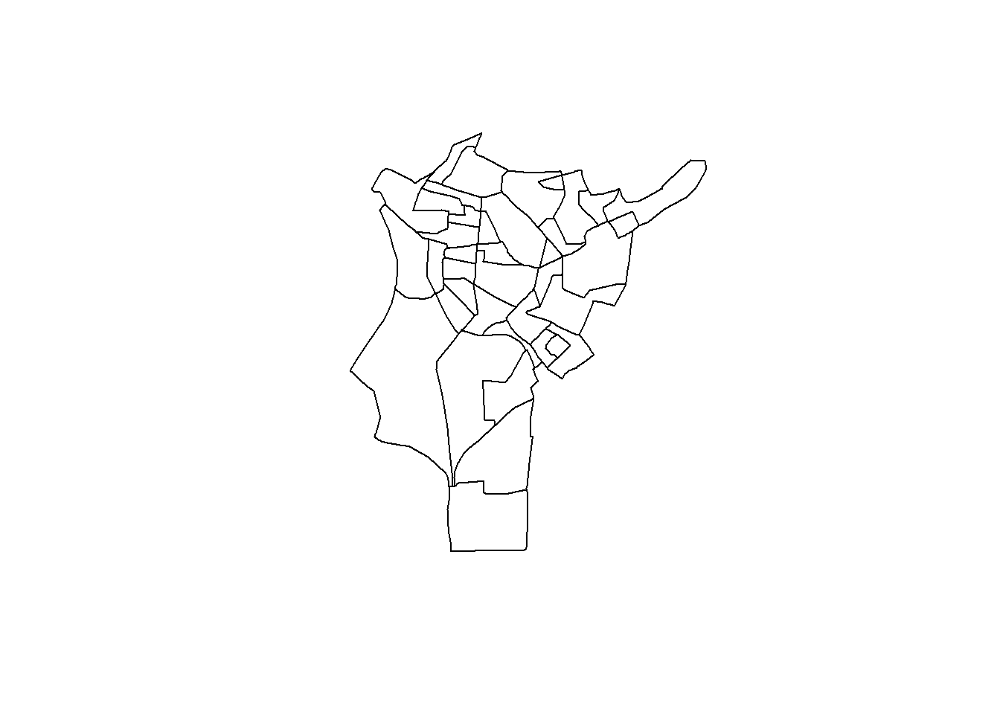

```{r setup, include=FALSE}
knitr::opts_chunk$set(echo = TRUE)
```

# Introduction

  La commune de Saint-Denis, située au nord de Paris, constitue un territoire où se jouent des dynamiques urbaines contemporaines marquées par de fortes inégalités socio-spatiales. Avec environ 110 000 habitants, elle est l’une des communes les plus peuplées et les plus denses du département de la Seine-Saint-Denis. Cette commune se caractérise aujourd’hui par une grande diversité sociale regroupant des populations aux niveaux de vie très différents : certains habitants disposent de revenus modestes, tandis que d’autres, plus aisés, s’installent progressivement dans certains quartiers. Ainsi, on observe à Saint-Denis un phénomène de gentrification, c’est-à-dire un processus de transformation urbaine où des populations plus aisées s’installent dans des quartiers populaires, entraînant une hausse des prix et une évolution progressive de la composition sociale du territoire.

Ces différences s’expliquent notamment par les transformations récentes de la ville. La rénovation de certains quartiers augmente l’attractivité et le développement de grands projets urbains attirent de nouveaux habitants, souvent plus favorisés. En parallèle, une partie de la population reste confrontée à des situations de précarité. Cette coexistence de populations aux revenus contrastés se traduit dans l’espace par une séparation plus ou moins marquée entre les quartiers.

La notion de fragmentation socio-spatiale renvoie justement à cette division de l’espace urbain en zones relativement homogènes socialement mais fortement différentes les unes des autres. Ces divisions ne sont pas uniquement liées aux revenus, mais aussi aux politiques urbaines, aux prix du logement ou encore à des phénomènes comme la gentrification ou la relégation sociale. À Saint-Denis, ces mécanismes sont visibles à travers la présence de quartiers populaires, de zones en rénovation et d’espaces plus attractifs en développement, notamment dans le cadre des projets du Grand Paris.

Ainsi, l’objectif de notre travail est d’analyser et de mettre en évidence les inégalités de revenus à Saint-Denis susceptibles d’engendrer des formes de fragmentation spatiale. Pour cela, nous allons répondre à la problématique suivante : 

Dans quelle mesure les inégalités de revenus à Saint-Denis se traduisent-elles par des formes de fragmentation socio-spatiale ?


# Description des données

- source des données
- type de données
- format
- emprise spatiale
- variables

# Problématique

Question étudiée.

Objectifs de l’analyse.

# Géotraitements vecteurs

Description des traitements réalisés.

## Schéma

(insérer image)

# Géotraitements rasters

Description des traitements réalisés.

## Schéma





# Jointures

Description des jointures attributaires ou spatiales.

# Conclusion

Résultats obtenus et limites.