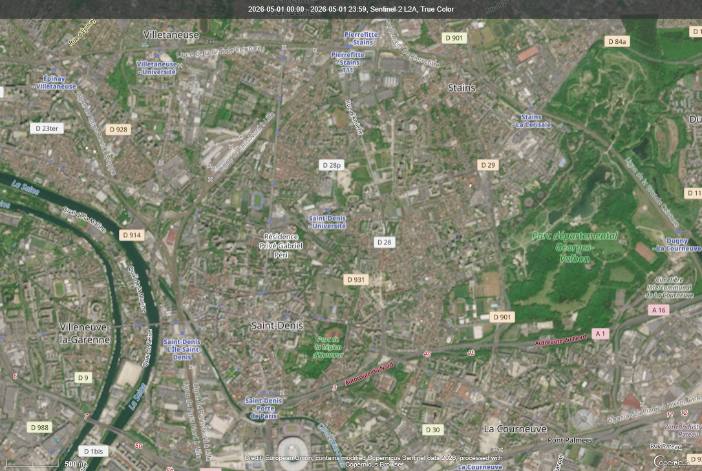
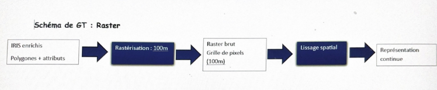

```{r setup, include=FALSE}
knitr::opts_chunk$set(echo = TRUE)
```



```{r}
library(terra)

r <- rast("index_files/image_sat_saint_denis.png")

r2 <- aggregate(r, fact = 2)

plot(r2)

```


Bien que notre analyse repose principalement sur des données vectorielles, un traitement raster peut être réalisé à partir des données IRIS afin d’obtenir une représentation continue des inégalités.




Dans un premier temps, les données vectorielles (polygones IRIS enrichis avec les variables issues de la base Filosofi de l’INSEE) sont converties en raster à l’aide d’une opération de rasterisation dans RStudio. Cette opération consiste à transformer chaque polygone en une grille de pixels, où chaque cellule reçoit la valeur de l’indicateur étudié (par exemple le revenu médian ou le taux de pauvreté). Dans notre cas, une résolution de 100 mètres peut être choisie, ce qui permet un bon compromis entre précision spatiale et lisibilité. La méthode utilisée est une rasterisation par attribution de valeur dominante (chaque pixel prend la valeur de l’IRIS dans lequel il se situe). Contrairement à une interpolation, aucune estimation entre zones n’est réalisée, ce qui garantit la cohérence avec les données statistiques initiales.Une fois le raster créé, il est possible d’appliquer un lissage spatial (filtre) afin de faire apparaître des tendances générales et de réduire les effets de discontinuité entre les IRIS. Ce traitement permet de mieux visualiser des gradients d’inégalités à l’échelle de la commune.

L’intérêt de cette approche est de proposer une lecture continue de l’espace, complémentaire de l’analyse vectorielle. Elle met en évidence des zones de transition et des gradients socio-spatiaux, moins visibles dans une représentation par polygones. Cependant, elle reste moins précise car elle repose sur une généralisation des données.
