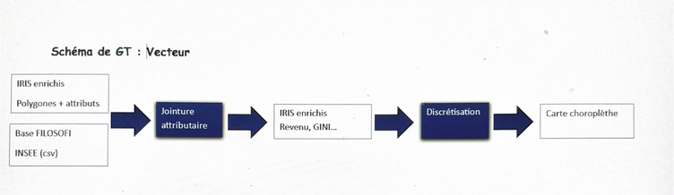

```{r setup, include=FALSE}
knitr::opts_chunk$set(echo = TRUE)
```

Le géotraitement vectoriel constitue le cœur de notre analyse, car les données utilisées sont organisées à l’échelle des IRIS. Il repose sur plusieurs étapes permettant de transformer des données brutes en informations spatialisées interprétables. 




Dans un premier temps, les contours des IRIS fournis par l’IGN sont importés dans RStudio. Ces données vectorielles, sous forme de polygones, définissent les unités spatiales d’analyse. Ensuite, les données statistiques issues de la base Filosofi de l’INSEE sont préparées et nettoyées afin de garantir la correspondance des identifiants avec les IRIS. 

L’étape clé est la jointure attributaire, qui consiste à associer à chaque polygone IRIS les variables socio-économiques (revenu médian, taux de pauvreté et indice de Gini). Cette opération permet de transformer des données statistiques en données spatiales exploitables. Une fois les données enrichies, un travail de discrétisation est réalisé afin de classer les valeurs en différentes catégories par exemple du plus faible au plus élevé. Cette étape est essentielle pour la représentation cartographique, notamment dans les cartes choroplèthes. Enfin, certaines opérations de fusion (dissolve) peuvent être mobilisées pour regrouper des IRIS présentant des caractéristiques similaires, ce qui permet de faire apparaître des zones homogènes.

L’ensemble de ces traitements permet d’identifier des logiques spatiales et de mettre en évidence la fragmentation socio-spatiale à l’échelle communale.


